# Tuning a neural network hyperparameters through a genetic evolution

The purpose of this notebook is to make a **simple proof-of-concept** of the ability for a genetic algorithm to automatically **tune the hyperparameters** of a neural network though evolutions. The goal will be to obtain **the best neural network model** that approximates the sin() function.

For a more acomplished analysis of the performance of this genetic algorithm, please visit my other work *"Application of a genetic algorithm on a Neural Network using Tensorflow - Malware detection with Machine Learning"*

**Author**: François Andrieux

- https://linkedin.com/in/francois-andrieux
- https://twitter.com/Spriteware
- https://github.com/Spriteware

You can get detailed explanations and other experiments on [franpapers.com](https://franpapers.com).    
   

**Summary**:
1.  The goal: approximate the sin() function
2.  Models
3.  Evolution
4.  Start the evolution!
    1.  Configure the fitness function
    2.  Create the initial population
    3.  Launch the evolution:
5.  Display the best player in the game
6.  Analyze how which parameter influences


```python
import genev # import genetic evolution core
from genev import Individual, Evolution

import time
import math
import sys
import copy
import seaborn as sns
import numpy as np
import pandas as pd
import matplotlib.pyplot as plt
from matplotlib import gridspec
from sklearn import utils

sns.set()
%matplotlib inline  
# %config InlineBackend.figure_format = "retina"
```

## The goal: approximate the sin() function


```python
X = np.linspace(0.0, 6.28318530718, num=25).reshape(25, 1)
Y = np.asarray([math.sin(x) for x in X]).reshape(25, 1)
plt.plot(X, Y, ".--");
```


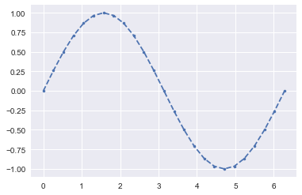


## Models


```python
import os
import tensorflow as tf

#os.environ["TF_CPP_MIN_LOG_LEVEL"] = "2"
```


```python
class Model():

    def __init__(self, learning_rate, momentum=0.9, lr_decay=0.0, hidden_layers=1, hidden_size=1, activation_id=0):
        
        self.learning_rate = learning_rate
        self.momentum = momentum
        self.lr_decay = lr_decay
        self.hidden_layers = hidden_layers
        self.hidden_size = hidden_size
        self.activation_id = activation_id
        
        self.train_losses = []
        self.test_losses = []
        self.times = []
        self.training_time = None
        self.aborted = False
        
        # Initialize session
        self.build()
        
    def build(self):
        
        tf.reset_default_graph()
        self.graph = tf.Graph()

        with self.graph.as_default():
            with tf.variable_scope("Core_layers"):

                activations = [tf.nn.sigmoid, tf.nn.tanh]
                activation = activations[self.activation_id]
                
                x = tf.placeholder(tf.float32, shape=(None, 1))
                y = tf.placeholder(tf.float32, shape=(None, 1))
                layers = [tf.layers.dense(inputs=x, units=1, activation=None)]

                for i in range(self.hidden_layers):
                    layers.append(tf.layers.dense(inputs=layers[-1], units=self.hidden_size, activation=activation))

                output = tf.layers.dense(inputs=layers[-1], units=1, activation=None)

                squared_deltas = tf.square(output - y)
                loss = tf.get_variable("loss", [1])
                loss = tf.reduce_sum(squared_deltas)

                optimizer = tf.train.RMSPropOptimizer(self.learning_rate, momentum=self.momentum, decay=self.lr_decay)
                train = optimizer.minimize(loss)

                self.x = x
                self.y = y
                self.loss = loss
                self.train = train
                self.output = output
                self.sess = tf.Session()

                assert loss.graph is self.graph
            
    def fit(self, X, Y, epochs):

        with self.graph.as_default():
            
            x, y = self.x, self.y
            loss, train = self.loss, self.train
            sess = self.sess
            
            sess.run(tf.global_variables_initializer())
            self.train_losses = []
            self.test_losses = []
            self.times = []

            for i in range(epochs):
    
                start = time.time()
                if i % 10 == 0:
                    loss_t = sess.run([loss], {x: X, y: Y})

                    if not np.isfinite(loss_t[0]):
                        self.aborted = True
                        break
                    self.test_losses.append(loss_t[0])
                else:
                    _, loss_t = sess.run([train, loss], {x: X, y: Y})

                    if not np.isfinite(loss_t):
                        self.aborted = True
                        break
                    self.train_losses.append(loss_t)
                    
                self.times.append(time.time() - start)

            self.train_losses = np.asarray(self.train_losses)
            self.test_losses = np.asarray(self.test_losses)
            self.training_time = np.sum(self.times)
            
            return self.train_losses, self.test_losses, self.times
    
    def predict(self, X):
        
        with self.graph.as_default():
            output = self.sess.run([self.output], {self.x: X})
            output = np.asarray(output)
            
        return output.reshape(output.shape[1], output.shape[2])
    
    def free(self):
        with self.graph.as_default():
            self.sess.close()
            
    def display(self, log_scale=False):
        train, test = np.asarray(self.train_losses), np.asarray(self.test_losses)
        # Todo : display like my other notebooks
        
        if log_scale is True:
            train, test = np.log(train), np.log(test)
            
        plt.plot(train, label="Train losses")
        plt.plot(np.linspace(0, train.shape[0], test.shape[0]), test, label="Test losses");
        plt.legend()
        plt.show()
        
    def __delete__(self):
        self.free()
```


```python
m1 = Model(learning_rate=0.005, momentum=0.85, lr_decay=0.0693, hidden_layers=5, hidden_size=13)
m2 = Model(learning_rate=0.005, momentum=0.85, lr_decay=0.0693, hidden_layers=5, hidden_size=13)
```


```python
ltrain, ltest, t = m1.fit(X, Y, epochs=800)
m1.display()
print("training_time", m1.training_time)

ltrain, ltest, t = m2.fit(X, Y, epochs=800)
m2.display()
print("training_time", m2.training_time)
```


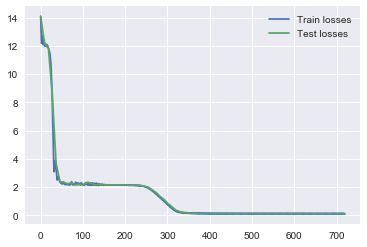


    training_time 0.738776683807373
    


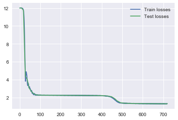


    training_time 0.5317940711975098
    


```python
sample = m1.predict(X)
plt.plot(X, Y, ".--");
plt.plot(X, sample, ".--r");
plt.show()

sample = m2.predict(X)
plt.plot(X, Y, ".--");
plt.plot(X, sample, ".--g");
plt.show()
```


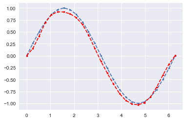


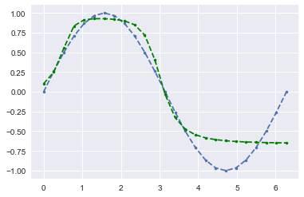


Important: do not forget to free the session, if not it will be huge in a while


```python
del m1
del m2
```

## Evolution


```python
skeleton = {
    "learning_rate": (float, lambda: 10 ** np.random.uniform(-4, 0)),
    "momentum": (float, lambda: np.random.uniform(0, 1)),
    "lr_decay": (float, lambda: 10 ** np.random.uniform(-6, 0)),
    "hidden_layers": (int, lambda: np.round(np.random.uniform(0, 5))),
    "hidden_size": (int, lambda: np.round(np.random.uniform(0, 25)))
}
```

## Start the evolution!
### Configure the fitness function
The fitness function is the most important here, because it is what determines the score of an individual and a generation. The more precise it is, the more you have control over how your individuals are chosen and the speed of the convergence towards a good generation, however it must stay suficiently free to reveal the real power of random solution.  
Here, the parameters are the following:
* The last **train loss**
* The last **test loss**
* The **time** for an epoch


```python
def calc_fitness(model):
    
    epochs = 1000
    train_losses, test_losses, times = model.fit(X, Y, epochs=epochs)    

    train = sys.maxsize if len(train_losses) == 0 else train_losses[-1] 
    test = sys.maxsize if len(test_losses) == 0 else test_losses[-1]    
    
    return train + test + np.mean(times) * 1000
```

### Create the initial population


```python
ev = Evolution(10, structure=Model, dna_skeleton=skeleton)
ev.model(Model, skeleton, calc_fitness)
ev.create()
ev.evaluate(display=True);
```

    evaluation: 100.00%	(10 over 10)
    

### Launch the evolution:


```python
ev.evolve(10);
ev.evaluate(display=True)
```

    0 -------------------------- 
    evaluation: 100.00%	(10 over 10)
    mutated: 6/7, 85.71% 
    1 -------------------------- 
    evaluation: 100.00%	(10 over 10)
    mutated: 6/7, 85.71% 
    2 -------------------------- 
    evaluation: 100.00%	(10 over 10)
    mutated: 6/7, 85.71% 
    3 -------------------------- 
    evaluation: 100.00%	(10 over 10)
    mutated: 6/7, 85.71% 
    4 -------------------------- 
    evaluation: 100.00%	(10 over 10)
    mutated: 6/7, 85.71% 
    5 -------------------------- 
    evaluation: 100.00%	(10 over 10)
    mutated: 6/7, 85.71% 
    6 -------------------------- 
    evaluation: 100.00%	(10 over 10)
    mutated: 6/7, 85.71% 
    7 -------------------------- 
    evaluation: 100.00%	(10 over 10)
    mutated: 6/7, 85.71% 
    8 -------------------------- 
    evaluation: 100.00%	(10 over 10)
    mutated: 6/7, 85.71% 
    9 -------------------------- 
    evaluation: 100.00%	(10 over 10)
    mutated: 6/7, 85.71% 
    evaluation: 100.00%	(10 over 10)
    

## Display the best player in the game 


```python
elite = ev.elite
elite.obj.display()
plt.show()

plt.plot(X, Y, ".--");
sample = elite.obj.predict(X)
plt.plot(X, sample, ".--r");
plt.show()
print(elite)
```


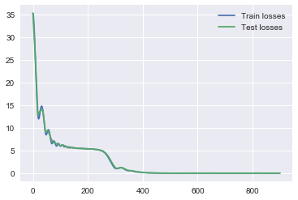


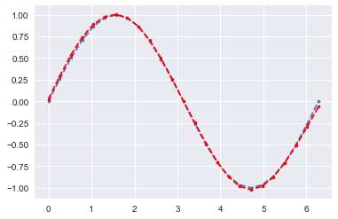


    [#48 / gen 8]	score is 0.696196474134922
    

## Analyze how which parameter influences


```python
list(ev.skeleton_stats.keys())
```


    ['learning_rate', 'momentum', 'lr_decay', 'hidden_layers', 'hidden_size']


The visual analysis will help us to understand which values were generated and how they are collerated to the success of the fitness score.


```python
ev.visual_analysis()
```


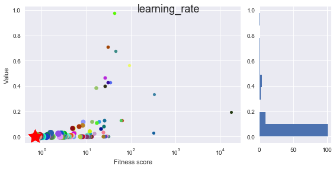


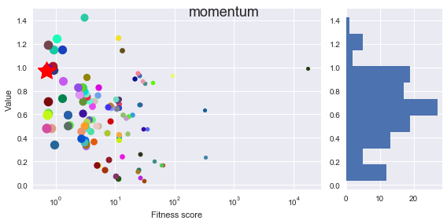


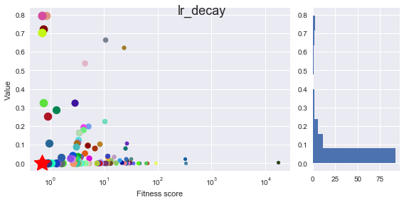


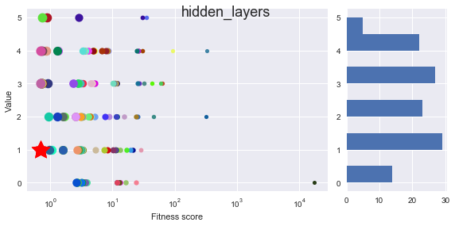


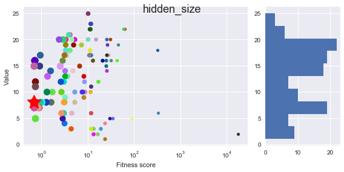


## Export the notebook


```python
!jupyter nbconvert --to markdown sine_genetic_approximation.ipynb
!mv sine_genetic_approximation.md README.md
```

    This application is used to convert notebook files (*.ipynb) to various other
    formats.
    
    WARNING: THE COMMANDLINE INTERFACE MAY CHANGE IN FUTURE RELEASES.
    
    Options
    
    -------
    
    
    
    Arguments that take values are actually convenience aliases to full
    Configurables, whose aliases are listed on the help line. For more information
    on full configurables, see '--help-all'.
    
    
    --debug
    
        set log level to logging.DEBUG (maximize logging output)
    
    --generate-config
    
        generate default config file
    
    -y
    
        Answer yes to any questions instead of prompting.
    
    --execute
    
        Execute the notebook prior to export.
    
    --allow-errors
    
        Continue notebook execution even if one of the cells throws an error and include the error message in the cell output (the default behaviour is to abort conversion). This flag is only relevant if '--execute' was specified, too.
    
    --stdin
    
        read a single notebook file from stdin. Write the resulting notebook with default basename 'notebook.*'
    
    --stdout
    
        Write notebook output to stdout instead of files.
    
    --inplace
    
        Run nbconvert in place, overwriting the existing notebook (only 
        relevant when converting to notebook format)
    
    --clear-output
    
        Clear output of current file and save in place, 
        overwriting the existing notebook.
    
    --no-prompt
    
        Exclude input and output prompts from converted document.
    --log-level=<Enum> (Application.log_level)
    
        Default: 30
    
        Choices: (0, 10, 20, 30, 40, 50, 'DEBUG', 'INFO', 'WARN', 'ERROR', 'CRITICAL')
    
        Set the log level by value or name.
    
    --config=<Unicode> (JupyterApp.config_file)
    
        Default: ''
    
        Full path of a config file.
    
    --to=<Unicode> (NbConvertApp.export_format)
    
        Default: 'html'
    
        The export format to be used, either one of the built-in formats, or a
    
        dotted object name that represents the import path for an `Exporter` class
    
    --template=<Unicode> (TemplateExporter.template_file)
    
        Default: ''
    
        Name of the template file to use
    
    --writer=<DottedObjectName> (NbConvertApp.writer_class)
    
        Default: 'FilesWriter'
    
        Writer class used to write the  results of the conversion
    
    --post=<DottedOrNone> (NbConvertApp.postprocessor_class)
    
        Default: ''
    
        PostProcessor class used to write the results of the conversion
    
    --output=<Unicode> (NbConvertApp.output_base)
    
        Default: ''
    
        overwrite base name use for output files. can only be used when converting
    
        one notebook at a time.
    
    --output-dir=<Unicode> (FilesWriter.build_directory)
    
        Default: ''
    
        Directory to write output(s) to. Defaults to output to the directory of each
    
        notebook. To recover previous default behaviour (outputting to the current
    
        working directory) use . as the flag value.
    
    --reveal-prefix=<Unicode> (SlidesExporter.reveal_url_prefix)
    
        Default: ''
    
        The URL prefix for reveal.js. This can be a a relative URL for a local copy
    
        of reveal.js, or point to a CDN.
    
        For speaker notes to work, a local reveal.js prefix must be used.
    
    --nbformat=<Enum> (NotebookExporter.nbformat_version)
    
        Default: 4
    
        Choices: [1, 2, 3, 4]
    
        The nbformat version to write. Use this to downgrade notebooks.
    
    To see all available configurables, use `--help-all`
    
    Examples
    --------
    
        The simplest way to use nbconvert is
        
        > jupyter nbconvert mynotebook.ipynb
        
        which will convert mynotebook.ipynb to the default format (probably HTML).
        
        You can specify the export format with `--to`.
        Options include ['asciidoc', 'custom', 'html', 'html_ch', 'html_embed', 'html_toc', 'html_with_lenvs', 'html_with_toclenvs', 'latex', 'latex_with_lenvs', 'markdown', 'notebook', 'pdf', 'python', 'rst', 'script', 'selectLanguage', 'slides']
        
        > jupyter nbconvert --to latex mynotebook.ipynb
        
        Both HTML and LaTeX support multiple output templates. LaTeX includes
        'base', 'article' and 'report'.  HTML includes 'basic' and 'full'. You
        can specify the flavor of the format used.
        
        > jupyter nbconvert --to html --template basic mynotebook.ipynb
        
        You can also pipe the output to stdout, rather than a file
        
        > jupyter nbconvert mynotebook.ipynb --stdout
        
        PDF is generated via latex
        
        > jupyter nbconvert mynotebook.ipynb --to pdf
        
        You can get (and serve) a Reveal.js-powered slideshow
        
        > jupyter nbconvert myslides.ipynb --to slides --post serve
        
        Multiple notebooks can be given at the command line in a couple of 
        different ways:
        
        > jupyter nbconvert notebook*.ipynb
        > jupyter nbconvert notebook1.ipynb notebook2.ipynb
        
        or you can specify the notebooks list in a config file, containing::
        
            c.NbConvertApp.notebooks = ["my_notebook.ipynb"]
        
        > jupyter nbconvert --config mycfg.py
    
    

    [NbConvertApp] CRITICAL | Bad config encountered during initialization:
    [NbConvertApp] CRITICAL | Unrecognized flag: '-v'
    mv: cannot stat 'sine_genetic_approximation.md': No such file or directory
    
